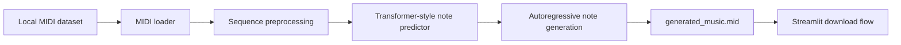

# IndianClassicalMusicGeneration

## Problem
This project explores automatic generation of Indian classical-style music from MIDI note sequences. The goal is to turn existing symbolic music data into new continuations that can be rendered back into MIDI and played or downloaded through a simple Streamlit interface.

## System Design

- Architecture:
  - data loading and note extraction in [`GenMusic.py`](C:\Users\91965\cars24\github-readme-batch\IndianClassicalMusicGeneration\GenMusic.py) and [`GenMusic2.py`](C:\Users\91965\cars24\github-readme-batch\IndianClassicalMusicGeneration\GenMusic2.py)
  - sequence modeling with TensorFlow / Keras multi-head attention blocks
  - MIDI export through `pretty_midi`
  - a Streamlit UI that lets the user choose raga, tala, and instrument before generating output
- Components:
  - model: Transformer-like sequence model over note pitches
  - data: local MIDI files loaded from a Windows path
  - UI: Streamlit controls and download button
  - output: generated MIDI composition
- There is no external DB, API service, RAG layer, or agent orchestration in this repository.

## Approach
- Why multi-agent?
  - Multi-agent is not used here. Music generation is implemented as a single training and inference pipeline around note-sequence modeling.
- Why RAG?
  - RAG is not relevant because the project is generating symbolic music from learned sequence patterns, not answering questions over retrieved documents.
- What the code actually does:
  - extracts note pitches from MIDI files
  - converts long songs into fixed-length training windows
  - predicts the next pitch token from previous note sequences
  - rolls the model forward step by step to create new notes
  - converts generated notes back into a MIDI file

## Tech Stack
- Python
- TensorFlow / Keras
- PrettyMIDI
- Librosa
- NumPy
- Matplotlib
- Streamlit

## Demo
- Place a MIDI dataset at the hard-coded local path used by the scripts
- Run the Streamlit app entry script
- Pick a raga, tala, and instrument in the UI
- Generate a new composition and download `generated_music.mid`

## Results
- The repo includes a sample generated MIDI artifact, which shows the end-to-end pipeline is wired through from data loading to output generation.
- The main tangible outcome is a prototype music generator with:
  - symbolic sequence ingestion
  - note-level model training
  - iterative generation
  - downloadable MIDI output

## Learnings
- What worked:
  - using MIDI note sequences keeps the representation lightweight compared with raw audio generation
  - a Streamlit front end makes the demo easy to use without packaging a full web backend
  - `GenMusic2.py` adds a more practical training path with batching and reduced sequence length
- What did not:
  - the selected raga, tala, and instrument are exposed in the UI but are not actually used to condition the model output in the current code
  - dataset paths are hard-coded to a local machine, which makes reproduction difficult
  - the repo README previously described files like `main.py` and `requirements.txt` that do not exist in the checked-in project
